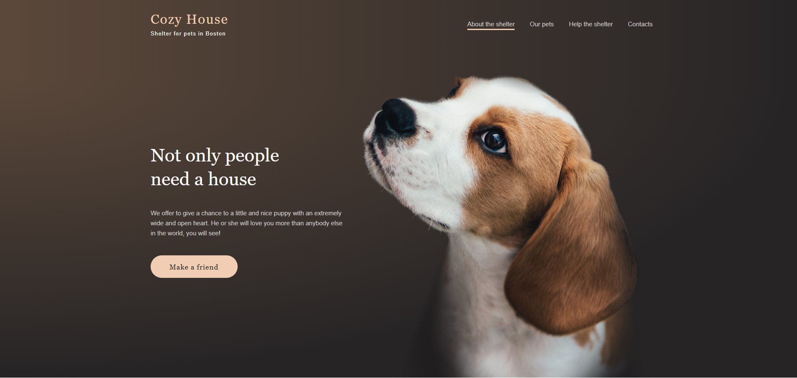
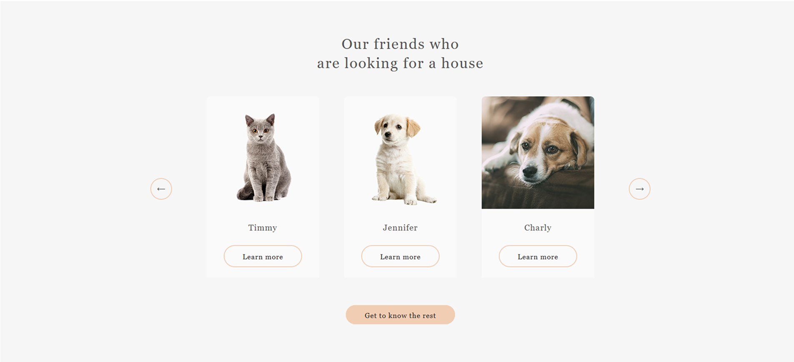
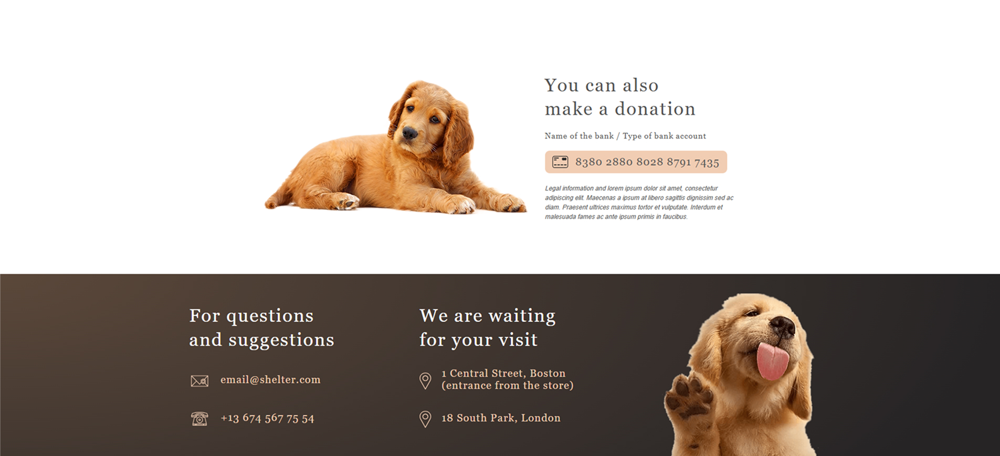

# 🐾 Shelter

**Shelter** is a responsive, interactive web project featuring a small animal adoption website.  
It demonstrates clean semantic markup, adaptive design, and interactive components implemented with **vanilla JavaScript**.

---

## 🎯 Features

- Two pages: **Main** and **Pets**
- Valid, semantic, mobile-friendly layout
- Fully responsive design (1280px → 320px)
- Interactive elements implemented with **pure JavaScript**, including:
  - Burger menu
  - Popups for pet cards
  - Infinite carousel slider on the main page
  - Pagination on the pets page
- Deployment via GitHub Pages or Netlify

---

## 🛠️ Tech Stack

- HTML5, CSS3, **SASS**
- JavaScript (ES Modules)
- ESLint (Airbnb), Prettier
- Autoprefixer, normalize.css
- Fonts: @fontsource/montserrat, @fontsource/allura

---

## 📸 Screenshots

---

## 🌐 Live Demo

[👉 Shelter](https://yevheniiorhanistyi.github.io/shelter/)
